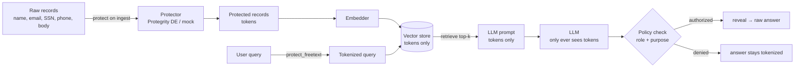

# AEGIS — Architecture & Threat Model

> Design premise: **the prompt injection wins.** We do not model a world where
> input filtering holds. We model the world after it fails, and ask: what does
> the attacker actually walk away with? The answer AEGIS forces is *tokens*.

## Data flow

Ingest is the *first* thing that touches the data; detokenization is the *last*,
and only for a caller that passes policy. The query is tokenized too, so
identifier lookups (`who is at 602-555-0148`) match on tokens without the raw
value ever hitting the store.

## What an attacker gets at each layer

| Attack | What they exfiltrate | Raw PII? |
|---|---|---|
| Dump the vector store / index files | tokens | ❌ No |
| **Invert the embeddings (Vec2Text)** | the *tokenized* text they encode | ⚠️ Tokens, not people |
| Capture / log the LLM prompt | tokens | ❌ No |
| Compromise the LLM provider | tokens | ❌ No |
| Indirect prompt injection → exfil (EchoLeak class) | tokens | ❌ No\* |
| Replay an unauthorized query | tokenized answer | ❌ No |
| **Compromise an already-authorized caller** | detokenized answer, for its policy scope | ⚠️ Yes |

**The embedding-inversion row is the honest one.** OWASP LLM08:2025 names it;
Morris et al. (Vec2Text, 2023) recovers ~92% of the *source text* from ada-002
embeddings. AEGIS doesn't stop inversion — it makes inversion pointless: the
source text was already tokenized, so the attacker reconstructs `tok:…` handles,
not names. `benchmark.py` runs a self-contained re-identification proxy of this
attack (nearest-name linkage): naive embeddings re-identify people ~83% of the
time, AEGIS embeddings drop to chance.

**\* The injection asterisk (residual risk, stated plainly).** Structured fields
(SSN, phone, email, name-as-field) are tokenized deterministically and never
appear raw. Free-text PII in ticket *bodies* is only as protected as the
detector: the offline `MockProtector` uses regex and **misses names in prose** —
`tests/test_no_raw_leak.py::test_no_freetext_names_leak` is an `xfail` that
proves exactly this gap instead of hiding it. Real Protegrity `find_and_protect`
runs PERSON NER and closes it. So: residual risk = detector recall, and we
measure it.

The residual risk that *remains by design* is a compromised, already-authorized
principal — and even that is bounded by policy (role + purpose, and in
production Protegrity's data-element scoping). That is where the risk *should*
sit, not sprayed across the store, the index, the prompt, and the logs.

## Why tokenize-before-embed, not redact-after

Redaction (the `MaskProtector` baseline) kills leakage but destroys utility:
every value collapses to one `[REDACTED]`, so records become indistinguishable,
identifier lookup dies, and the value is gone forever. **Tokenization is
reversible and deterministic** — same value → same token — so retrieval, joins,
and identifier lookup still work on protected data, and an authorized reveal is
exact. `benchmark.py` quantifies the tradeoff: mask and AEGIS tie on privacy
(0.00 leakage); AEGIS wins utility (identifier recall 1.00 vs 0.50, authorized
reveal 1.00 vs 0.00).

The known cost: tokenize-before-embed **weakens pure semantic retrieval** (the
embedder sees opaque handles, not words), which is why the pipeline uses
**hybrid retrieval** — exact token match for identifiers + semantic over the
tokenized query for topics. Field-level tokenization (bodies stay largely
natural language; only PII spans become tokens) keeps topic recall at 1.00 in
the benchmark.

## Mapping to OWASP LLM Top 10 (2025)

- **LLM08:2025 — Vector & Embedding Weaknesses** (the headline): embedding
  inversion + leakage from the vector store. AEGIS's answer is that the vectors
  encode tokens, so inversion and store-theft yield tokens. This is the category
  the whole design targets.
- **LLM02:2025 — Sensitive Information Disclosure**: PII in the store, prompt,
  logs, and model I/O is tokenized; disclosure yields tokens.
- **LLM01:2025 — Prompt Injection**: AEGIS explicitly does **not** claim to
  prevent it. It assumes injection succeeds and removes the payoff. Pair with a
  control-flow defense (CaMeL / Dual-LLM) for defense-in-depth — they gate the
  *action*, AEGIS gates the *data*.

## Prior art (so the novelty claim stays honest)

- **Tokenization for LLMs is established**: Skyflow LLM Privacy Vault (near-exact
  productized pattern), Microsoft Presidio (open-source detect + anonymize),
  Protegrity itself. AEGIS is a concrete, benchmarked, *attacked* instance — not
  a new primitive.
- **Injection defense is converging on "by design"**: Willison's lethal
  trifecta, DeepMind CaMeL. AEGIS is the data-layer complement to that school.
- **What's actually original here**: the adversarial harness (`attack_demo.py`),
  the joint privacy/utility/attack benchmark (`benchmark.py`), the query-side
  tokenization for identifier retrieval, the policy-gated reveal, and the refusal
  to overclaim (the `xfail`, this section).

## Production notes (real Protegrity Developer Edition)

- Set `AEGIS_PROTECTOR=protegrity`; `ProtegrityProtector` is already written to
  the published API. Free text → `find_and_protect` / `find_and_unprotect`
  (PERSON NER closes the name gap); structured → `appython` session
  protect/unprotect with data elements.
- Move the authorization decision out of `policy.py` into Protegrity's **policy
  engine** (roles / purposes / data-elements) so detokenization is enforced by
  the data-protection layer, not the app.
- Crypto is a hosted API call (10k req/day, 1MB payload, 15-min sessions) —
  batch large ingests via the bulk API; cache tokens for repeated values.
