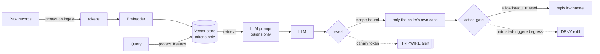

# AEGIS — Architecture & Threat Model

> Design premise: **the prompt injection wins.** We don't model a world where
> input filtering holds. We model the world after it fails and ask what the
> attacker actually walks away with. Four layers make the answer *nothing usable*.

## The four layers

1. **Data-gate** — tokenize PII before it touches embed / store / LLM. Store theft, embedding inversion, and prompt/log capture yield tokens.
2. **Scope-bound reveal** — every token carries an *owner*; the caller carries a *scope*. `reveal` detokenizes only tokens the scope authorizes. An injected authorized agent gets its own case back and *tokens* for everyone else.
3. **Tripwire + ledger** — canary records whose reveal fires an attributed alert (detok-as-IDS); every real reveal is a hash-chained, purpose-bound receipt (tamper-evident; GDPR Art.30).
4. **Action-gate** — least-privilege egress policy: deny untrusted-triggered or off-allowlist actions, so a compromised authorized session still can't exfiltrate.

## What an attacker gets at each layer

| Attack | What they exfiltrate | Raw PII? | Covered by |
|---|---|---|---|
| Dump the vector store / index files | tokens | ❌ No | data-gate |
| Invert the embeddings (Vec2Text) | the *tokenized* text they encode | ⚠️ Tokens, not people | data-gate |
| Capture / log the LLM prompt | tokens | ❌ No | data-gate |
| Indirect injection, **anonymous** caller | tokens | ❌ No | data-gate |
| Indirect injection, **authorized** agent | its own case only; others stay tokens | ⚠️ Own scope only | **scope-bound reveal** |
| Compromised authorized session tries to **send data out** | nothing — egress denied | ❌ No | **action-gate** |
| Probe a canary record | — (and you just tripped the alarm) | ❌ No | **tripwire** |

The old draft conceded "compromise an authorized caller → raw PII: Yes" as a one-line edge case. A 4-agent audit showed it was the *common* case (the agent is the authorized principal — the EchoLeak scenario) and reproduced a full multi-customer leak. Layers 2 and 4 close it: an authorized caller reveals only its own case, and even a fully compromised session can't ship the data out.

**Residual, stated plainly:** free-text PII protection = **detector recall**. The offline mock uses regex and misses names in prose (`tests/…::test_no_freetext_names_leak`, an `xfail`). Real Protegrity `find_and_protect` runs PERSON NER and closes it. We measure the gap; we don't hide it.

## Proven against a real model, not just a mock

The offline `MockLLM` echoes context, so it can only prove the *data-layer invariant*. `real_llm_demo.py` runs the indirect injection through a **real Claude**: on the naive pipeline the real model emitted a real customer email; on AEGIS the same model emitted `Customer: tok:8c18…`. The guarantee is **upstream of whether the model complies** — it cannot exfiltrate raw PII it never received.

## Why tokenize-before-embed, not redact-after

Redaction (`MaskProtector`) kills leakage but destroys utility: every value collapses to one `[REDACTED]`, identifier lookup dies, the value is gone forever. Deterministic tokenization preserves referential integrity — retrieval, joins, and identifier lookup work on protected data, and an authorized reveal is exact. Measured (`benchmark.py`, real MiniLM embeddings, fair baseline):

| | topic recall | identifier recall | store leak | authorized reveal | re-id (lexical) |
|---|---|---|---|---|---|
| naive | 1.00 | 1.00 | 1.00 | 1.00 | **1.00** |
| mask | 1.00 | 0.50 | 0.00 | **0.00** | 0.00 |
| **AEGIS** | 1.00 | **1.00** | **0.00** | **1.00** | **0.00** |

Plaintext embeddings re-identify people 100% of the time; AEGIS 0%. AEGIS matches plaintext utility at mask-level privacy. Known cost: tokenize-before-embed weakens *pure* semantic retrieval (the embedder sees opaque handles), which is why retrieval is **hybrid** — exact token/identifier match + semantic over the tokenized query. Field-level tokenization keeps topic words natural, so topic recall holds.

## Mapping to OWASP LLM Top 10 (2025)

- **LLM08:2025 — Vector & Embedding Weaknesses** (headline): inversion + store leakage → tokens. The category the design targets.
- **LLM02:2025 — Sensitive Information Disclosure**: PII in store/prompt/logs/model I/O is tokenized.
- **LLM01:2025 — Prompt Injection**: explicitly **not** prevented — assumed to succeed. Layers 2–4 remove the payoff and the egress. Kin to CaMeL / Dual-LLM for defense-in-depth.

## Prior art (novelty kept honest)

- **Tokenization for LLMs is established**: Skyflow LLM Privacy Vault (near-exact productized pattern), Presidio, Protegrity. AEGIS is a benchmarked, *attacked* instance — not a new primitive.
- **Injection defense is converging on "by design"**: lethal trifecta, CaMeL. The action-gate is a scoped instance.
- **Original here**: scope-bound reveal, detok-as-IDS honeytokens, the signed reveal ledger, the paired action-gate, and the refusal to overclaim (the xfail, this document, the audit that reshaped it).

## Production notes (real Protegrity Developer Edition)

- `AEGIS_PROTECTOR=protegrity`; `ProtegrityProtector` is written to the published API. Free text → `find_and_protect`/`find_and_unprotect` (PERSON NER); structured → `appython` session with data elements; deterministic FPE makes `tokens_in` recover query tokens for identifier retrieval on the real backend.
- Move scope + authorization into Protegrity's **policy engine** (roles / purposes / data-elements / row filters) so the reveal decision lives with the data-protection layer, not the app.
- Crypto is a hosted API call (10k req/day, 1MB payload, 15-min sessions) — batch large ingests, cache tokens for repeated values.
