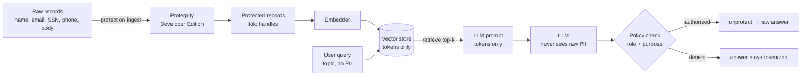

# AEGIS — Architecture & Threat Model

## Data flow

**The protection boundary** wraps everything except the final authorized reveal.
Ingest is the *first* thing that touches the data, and detokenization is the
*last* — and only for a caller that passes policy.

## What an attacker gets at each layer

| Attack                              | What they exfiltrate            | Raw PII? |
|-------------------------------------|---------------------------------|----------|
| Dump the vector store / index files | `tok:…` handles                 | ❌ No     |
| Steal the embeddings                | vectors of tokenized text       | ❌ No     |
| Capture / log the LLM prompt        | tokens only                     | ❌ No     |
| Compromise the LLM provider         | tokens only                     | ❌ No     |
| Replay an unauthorized query        | tokenized answer                | ❌ No     |
| **Compromise an authorized caller** | detokenized answer for its scope| ⚠️ Yes    |

The residual risk is exactly where it *should* be — a compromised, already-
authorized principal — and even that is bounded by policy (role + purpose +,
in production, Protegrity's data-element scoping).

## Why tokenize-before-embed, not redact-after

Redaction destroys utility and is leaky (regex misses cases). **Tokenization is
reversible and deterministic**: the same value maps to the same token, so
retrieval and joins still work on protected data, and an authorized reveal is
exact. The model reasons over stable handles; only the presentation layer, for
an authorized caller, resolves them.

## Mapping to OWASP LLM Top 10

- **LLM02 / LLM06 — Sensitive Information Disclosure:** the primary risk AEGIS
  neutralizes. PII never enters the store, the prompt, or the model.
- **LLM08 — Excessive Agency / data exfil via tools:** an agent built on this
  pipeline can only ever pass tokens downstream; blast radius of a leaked handle
  is zero raw data.
- **Gate the data, not the prompt:** input filtering can't recover *intent or
  authorization* from a string. AEGIS enforces at the data layer, where the
  decision is deterministic — the same thesis as AISeal / badash-killchain.

## Production notes (with real Protegrity Developer Edition)

- Replace `MockProtector` with `ProtegrityProtector` (`aegis/protection.py`).
- Move the authorization decision out of `policy.py` and into Protegrity's
  **policy engine** (roles / purposes / data-elements), so detokenization is
  enforced by the data-protection layer itself, not the application.
- Classify PII with Protegrity's classifiers instead of the demo regexes in
  `pii.py`.
